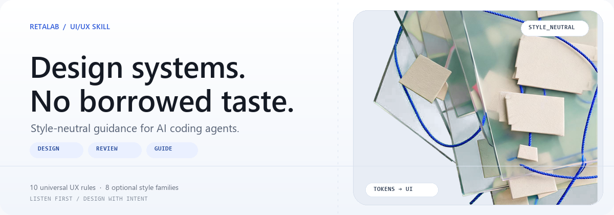
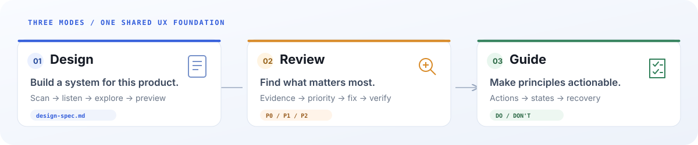

# Retalab Skill

> Define design systems, review interfaces, and turn UX principles into implementation-ready fixes—without imposing one visual style.

<p align="center">
  
</p>

**RetaLab Skill** helps coding agents and product teams make better interface decisions. It reads the project first, listens for product and brand constraints, then helps shape a design system or improve a specific interface.

It separates universal usability principles from visual preferences: users choose the style; the Skill keeps the experience clear, consistent, and actionable.

## Three ways to use it

| Mode | Use it to | Output |
|---|---|---|
| `design` | Define or refine a project design system | A project-specific `design-spec.md`, after reviewing a business-page mockup |
| `review` | Audit an existing interface | Prioritized `P0 / P1 / P2` findings, concrete fixes, and verification checks |
| `guide` | Establish rules for a page or flow | A concise do/don't checklist for that surface |

`design` is the default. Ask lightweight visual questions directly; they don't trigger the full design workflow.

<p align="center">
  
</p>

## Install

Install for one or more supported agents:

```bash
npx skills add unrealretamal/retalabskill -a codex -a claude-code -a cursor -a windsurf
```

Install globally:

```bash
npx skills add unrealretamal/retalabskill -g -a codex -a claude-code -a cursor -a windsurf
```

Or clone the repository and place `skills/retalabskill` in your agent's skills directory.

## Try it

### Design a system

```text
Use $retalabskill to define this project's design system.
Scan the existing tokens first. Ask about anything important that's still unknown.
Show me a preview on one of my product pages before writing design-spec.md.
```

### Review a screen

```text
Use $retalabskill in review mode.
Review this dashboard for first-time users completing setup.
Give me P0/P1/P2 findings, actionable fixes, and verification checks.
```

### Get page-specific guidance

```text
Use $retalabskill in guide mode.
Page: B2B settings form with 8 fields.
Cover CTA hierarchy, states, affordance, error prevention, help text, and spacing.
Keep it to concise do/don't bullets.
```

## What keeps the advice grounded

### Ten cross-style UX rules

1. Make the primary task and action clear within seconds.
2. Cover loading, empty, error, success, and permission states.
3. Make actions discoverable; show constraints before submission.
4. Prevent errors and provide a way to recover.
5. Close the feedback loop: what happened, what changed, what's next?
6. Keep equivalent interactions consistent within the project.
7. Use contrast, repetition, alignment, and proximity to establish hierarchy.
8. Choose a spacing scale and apply it consistently.
9. Layer help by urgency: always visible, nearby, on demand, or after action.
10. Write UI copy for user tasks and system outcomes—not design-generation metadata.

### Eight optional style families

Choose a visual lens only when it fits the project. None is imposed by default.

`modern-minimal` · `editorial` · `brutal` · `playful` · `premium-luxury` · `tech-cyberpunk` · `warm-content` · `brand-driven`

The family informs typography, color, shape, spacing, and motion. Its taste-specific conventions never become global UX rules.

## How `design` works

1. **Scan first:** inspect existing tokens, UI framework, and real interface files.
2. **Listen:** reuse established decisions and ask only about important unknowns.
3. **Explore:** compare visual directions and token choices without assuming a house style.
4. **Preview:** test the system on the project's own page and refine with your feedback.
5. **Document:** produce `design-spec.md` after you approve the business-page preview.

## Repository map

```text
.
├── AGENTS.md
├── CLAUDE.md
├── agents/openai.yaml
├── index.html                         # Interactive overview and UI examples
└── skills/retalabskill/
    ├── SKILL.md                       # Skill behavior and workflows
    ├── evals/evals.json
    └── references/                     # Interview, UX, review, and style guidance
```

## License

Apache-2.0. See [`LICENSE.txt`](./LICENSE.txt).

